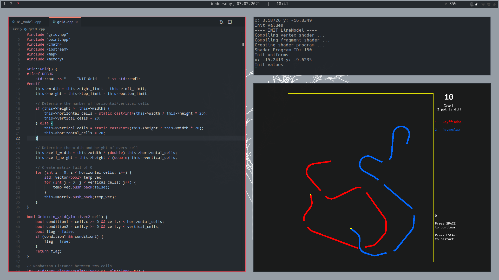
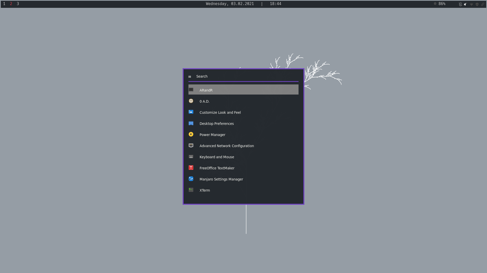
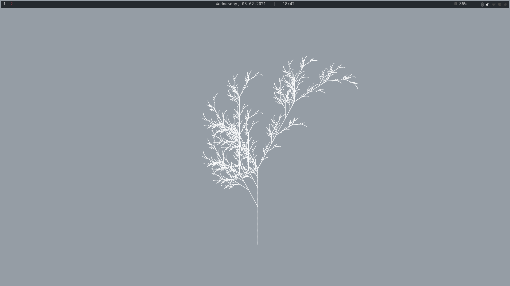

# dotfiles


Dotfiles for a fresh install of Manjaro i3 (Community Edition). It has 2 
scripts, one for a completly fresh install (fresh-build.sh) and one to update
the dotfiles.

The fresh-build.sh script install the following programs:
* rofi
* firefox
* hsetroot
* okular
* zathura
* cmake
* glfw-x11
* polybar
* VScode
* oh-my-zsh


For the fresh install:
```bash
sh fresh-build.sh
```

To update the dotfiles
```bash
sh update.sh
```

The fresh install script install VSCode and other programas that I use for 
development.

# Screenshots



